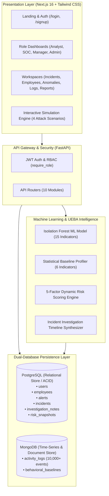
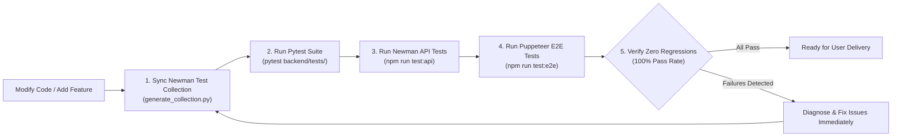

# ITBIS Project — Comprehensive Agent Guide & Repository Instructions

Welcome to the **Insider Threat Behavioral Intelligence System (ITBIS)** codebase. This document serves as the master architectural reference, operational runbook, coding standard, and mandatory testing protocol for all AI agents, engineers, and developers working in this repository.

---

## 1. Repository Architecture & Layout

The project is structured as a full-stack monorepo featuring a FastAPI Python backend, a Next.js (App Router) frontend, machine learning artifacts, Jupyter research notebooks, synthetic dataset generators, and automated end-to-end and API testing suites.

```
AI-Powered-Insider-Threat-Detection-and-Behavioral-Security-Intelligence-Platform/
├── AGENTS.md                                   # Master repository guide & agent rules (this file)
├── DESIGN.md                                   # UI/UX Design tokens, color palette, typography & specs
├── .env.example                                # Root environment variable template
├── docs/                                       # Architectural designs & specifications
│   └── architecture-and-database.md
├── backend/                                    # FastAPI Backend Service (Python)
│   ├── .env.example                            # Backend environment template
│   ├── requirements.txt                        # Python backend & ML dependencies
│   ├── package.json                            # Newman testing runner dependencies & scripts
│   ├── models/                                 # Serialized Machine Learning artifacts
│   │   ├── isolation_forest_model.joblib       # Pre-trained 15-indicator Isolation Forest model
│   │   └── isolation_forest_model_metadata.json# Model hyperparameters, feature list & metrics
│   ├── data/                                   # Seed & baseline CSV datasets
│   │   ├── employee_directory.csv              # Monitored employee directory
│   │   ├── synthetic_activity_logs_10000.csv   # 10,000+ realistic synthetic security event logs
│   │   ├── behavioral_baselines.csv            # Pre-computed 6-indicator baseline profiles
│   │   └── generated_ml_threat_alerts.csv      # Model-flagged threat alerts
│   ├── app/
│   │   ├── database.py                         # PostgreSQL (SQLAlchemy) & MongoDB (PyMongo) connections
│   │   ├── main.py                             # FastAPI app initialization, CORS, and route registration
│   │   ├── models.py                           # SQLAlchemy ORM models (users, employees, incidents, alerts, etc.)
│   │   ├── schemas.py                          # Pydantic request & response validation schemas
│   │   ├── security.py                         # JWT authentication, bcrypt hashing, and RBAC dependencies
│   │   ├── ml_engine.py                        # Core ML model loader, feature extractor, and inference engine
│   │   ├── ml_anomaly_model.py                 # Enriched ML anomaly reporting & training pipelines
│   │   ├── behavioral_profiling.py             # 6-indicator statistical baseline calculation engine
│   │   ├── anomaly_detection.py                # Rule-based and z-score anomaly detection heuristics
│   │   ├── risk_scoring.py                     # 5-factor UEBA dynamic risk scoring & snapshot recorder
│   │   ├── ueba_engine.py                      # Peer group comparison & 14-day UEBA trend aggregators
│   │   ├── investigation_timeline.py           # Multi-source timeline synthesizer for incident investigation
│   │   ├── seed_data.py                        # Initial employee & activity log seeder
│   │   ├── seed_10k_data.py                    # 10,000-event high-throughput activity log seeder
│   │   └── routes/                             # API Route Modules
│   │       ├── auth_routes.py                  # User registration, login & JWT token issuance
│   │       ├── admin_routes.py                 # User RBAC administration & system telemetry
│   │       ├── employee_routes.py              # Employee directory CRUD & profile inspection
│   │       ├── department_routes.py            # Department risk aggregations & metrics
│   │       ├── log_routes.py                   # High-throughput MongoDB activity log ingestion & query
│   │       ├── alert_routes.py                 # Security alert lifecycle (assign, triage, resolve)
│   │       ├── anomaly_routes.py               # ML threat scan, live evaluation, simulation & baselines
│   │       ├── incident_routes.py              # Incident creation, timeline synthesis & evidence notes
│   │       ├── report_routes.py                # Compliance, departmental risk & exportable reports
│   │       └── ueba_routes.py                  # 5-factor risk scoring, peer comparison & daily snapshots
│   ├── notebooks/
│   │   └── ITBIS_Isolation_Forest_Threat_Detection.ipynb # Milestone 2 ML model training & EDA
│   └── tests/                                  # Backend Automated Test Suites
│       ├── generate_collection.py              # Dynamic Postman/Newman collection generator
│       ├── run_api_tests.js                    # Newman CLI test runner with HTML/JSON reports
│       ├── itbis_api_collection.json           # Generated Postman collection
│       ├── itbis_api_environment.json          # Postman environment configuration
│       ├── test_milestone2.py                  # Pytest suite for ML, UEBA, baselines & incidents
│       └── reports/                            # Newman execution reports (HTML, JSON, Markdown)
│           ├── api_test_report.html
│           ├── api_test_report.json
│           └── summary.md
└── frontend/                                   # Next.js Frontend Application (React 19, Tailwind CSS)
    ├── package.json                            # Frontend dependencies, Tailwind, and Puppeteer
    ├── next.config.mjs                         # Next.js configuration
    ├── postcss.config.mjs                      # PostCSS / Tailwind CSS setup
    ├── app/                                    # Next.js App Router (Pages, Layouts & Components)
    │   ├── layout.js                           # Root application layout & provider wrapping
    │   ├── page.js                             # Public Landing / Platform Overview page
    │   ├── globals.css                         # Global CSS & Tailwind design tokens
    │   ├── login/page.js                       # User authentication & role selection
    │   ├── signup/page.js                      # New account registration
    │   ├── dashboard/                          # Role-Based Dashboard Hub
    │   │   ├── page.js                         # Dynamic role-router dashboard overview
    │   │   ├── analyst/page.js                 # Security Analyst / Tier-2 Investigation view
    │   │   ├── soc/page.js                     # SOC Incident Response & Live Telemetry Stream
    │   │   ├── manager/page.js                 # Department Manager & Risk Oversight view
    │   │   └── admin/page.js                   # System Administrator & Governance overview
    │   ├── employees/                          # Employee Directory & Profile Drawer
    │   │   ├── page.js                         # Filterable employee directory with 5-factor risk bars
    │   │   └── [id]/page.js                    # Detailed 360-degree employee risk profile
    │   ├── incidents/                          # Incident Management & Investigation
    │   │   ├── page.js                         # Security incident management table & filters
    │   │   └── [id]/page.js                    # Deep investigation workspace with timeline & notes
    │   ├── alerts/page.js                      # Real-time alert triage queue & status transitions
    │   ├── anomalies/page.js                   # ML Model diagnostics, baseline tables & interactive sandbox
    │   ├── logs/page.js                        # Raw activity logs explorer with multi-field filtering
    │   ├── reports/page.js                     # Compliance & risk intelligence reports (CSV export)
    │   ├── admin/page.js                       # Admin RBAC management & user role assignments
    │   ├── support/page.js                     # System documentation, FAQs & architecture guide
    │   ├── components/                         # Modular Reusable UI Components
    │   │   ├── AppLayout.js                    # Main navigation shell with sidebar & header
    │   │   ├── Header.js                       # Top navigation bar, simulation trigger & notifications
    │   │   ├── Sidebar.js                      # Role-aware navigation sidebar
    │   │   ├── MetricCard.js                   # KPI and metric statistics cards
    │   │   ├── RadarScanner.js                 # Threat radar animation scanner
    │   │   ├── RealtimeAlertNotification.js    # Animated floating threat alert toast
    │   │   ├── RiskBadge.js                    # Color-coded risk badges (Low, Medium, High, Critical)
    │   │   └── RoleGuard.js                    # Client-side RBAC route protection
    │   ├── context/                            # React State Contexts
    │   │   ├── AuthContext.js                  # Authentication token, user profile & role state
    │   │   └── SimulationContext.js            # Real-time threat simulation state & dispatch
    │   └── lib/                                # Utilities & API Client
    │       └── api.js                          # Axios client with JWT auto-injection & error handling
    ├── tests/
    │   └── puppeteer_test_all.js               # Comprehensive 39-step Puppeteer E2E visual test suite
    └── test-results/                           # Puppeteer E2E Test Reports & Screenshots
        ├── reports/
        │   ├── puppeteer-test-report.html      # Visual E2E test report
        │   ├── summary.md                      # Puppeteer test summary
        │   └── test-summary.json               # Structured test execution results
        └── screenshots/                        # Captured 39 full-page UI flow screenshots
```

---

## 2. Core Architecture & Persistence Layer

ITBIS employs a **4-layer architecture** with a **dual-database persistence strategy** designed for high security, relational integrity, and high-throughput security event ingestion:



### 1. PostgreSQL (Relational Store / ACID)
- **Entities:** `users`, `employees`, `incidents`, `alerts`, `investigation_notes`, `risk_snapshots`.
- **Purpose:** Governs user authentication, identity, employee organizational hierarchy (manager-subordinate relations), alert lifecycles, structured incident investigations with evidence notes, and historical daily risk score snapshots.

### 2. MongoDB (Document / Time-Series Store)
- **Collections:** `activity_logs`, `behavioral_baselines`.
- **Purpose:** Stores high-volume telemetry events (logins, file transfers, USB connections, privilege changes, email activity, web browsing) and pre-calculated statistical behavioral baselines (mean, standard deviation, percentiles).

### 3. Cross-Database Integrity Rules
- **Pre-Ingestion Validation:** Ingesting activity logs into MongoDB (`POST /logs/`) must **always validate** that the `employee_id` exists in the PostgreSQL `employees` table before writing.
- **Cascade Synchronization:** When triggering threat simulations or baseline calculations, both MongoDB event collections and PostgreSQL alerts/snapshots must be synchronized atomically or handled with graceful rollbacks.

---

## 3. Role-Based Access Control (RBAC) & Personas

ITBIS implements fine-grained Role-Based Access Control across four primary operational personas:

| Persona Role | Role Title | Primary Responsibilities & Access Scope | Key Dashboard & Navigation Features |
| :--- | :--- | :--- | :--- |
| `admin` | **System Administrator** | Complete system governance, user provisioning, RBAC role assignments, audit log review, and system configuration. | `/dashboard/admin`, `/admin` (RBAC management), full CRUD across all entities. |
| `security_manager` | **Department Manager** | Department-level threat visibility, compliance oversight, team risk trends, employee risk drill-down, and incident review. | `/dashboard/manager`, `/reports` (Compliance & Department reports), employee risk profiles. |
| `soc_engineer` | **SOC Incident Response** | Real-time telemetry monitoring, live log stream analysis, raw log ingestion, instant host isolation, and immediate alert triage. | `/dashboard/soc`, `/logs` (Raw log stream & ingest), `/alerts` (Active triage queue). |
| `security_analyst` | **Security Analyst (Tier 2)** | Deep incident investigations, evidence gathering, timeline synthesis, 5-factor UEBA analysis, ML anomaly sandbox, and alert resolution. | `/dashboard/analyst`, `/incidents/[id]` (Investigation workspace), `/anomalies` (ML model & sandbox). |

### Security Enforcement
- **Backend:** Enforced using FastAPI dependency `require_role("admin", "security_analyst", ...)`. Tokens are signed JWT Bearer tokens carrying `sub` (User ID), `email`, and `role` claims.
- **Frontend:** Enforced using `<RoleGuard allowedRoles={["admin", ...]}>` and the `AuthContext` state hook.

---

## 4. Machine Learning & UEBA Intelligence Pipeline

### 1. Isolation Forest Anomaly Detection Model
- **Artifact:** Stored in `backend/models/isolation_forest_model.joblib` with metadata in `isolation_forest_model_metadata.json`.
- **15 Behavioral Indicators:**
  1. `avg_login_hour` & `std_login_hour`
  2. `off_hours_logins`
  3. `mean_daily_access` & `std_daily_access`
  4. `total_transfer_mb`, `avg_transfer_mb`, & `max_single_transfer_mb`
  5. `usb_event_count` & `usb_total_mb`
  6. `sudo_attempts` & `denied_events`
  7. `critical_flags`
  8. `unique_devices`
  9. `email_count`
- **Output:** Anomaly Decision Score, Outlier Flag (`is_outlier`), Dynamic Risk Tier (`Low`, `Medium`, `High`, `Critical`), Explainable Root Causes (`primary_reason`), and Target Persona dispatching.

### 2. 5-Factor Dynamic Risk Scoring Engine (`risk_scoring.py`)
Calculates a normalized risk score on a **0–100 scale** using a weighted composite formula:
$$\text{Risk Score} = 0.25 \times S_{\text{behavioral}} + 0.20 \times S_{\text{privilege}} + 0.25 \times S_{\text{data\_access}} + 0.15 \times S_{\text{access\_pattern}} + 0.15 \times S_{\text{historical}}$$

- **Factor 1 (25%): Behavioral Anomalies** — Deviations from statistical baselines (login times, transfer volumes).
- **Factor 2 (20%): Privilege Misuse** — Unauthorized sudo executions, permission escalations, failed admin commands.
- **Factor 3 (25%): Data Access Violations** — High-volume file downloads, mass USB transfers, off-hours repository clones.
- **Factor 4 (15%): Access Pattern Deviations** — Abnormal IP locations, new/unknown device fingerprints, weekend access.
- **Factor 5 (15%): Historical Security Events** — Active unresolved alerts, past critical incidents, repeat offenses.

### 3. Real-Time Interactive Threat Simulation Engine
Allows security teams and evaluators to trigger instant high-risk attacks:
- **Scenario 1: Mass USB Data Exfiltration** — Ingests large USB transfer telemetry, alerts SOC Incident Response.
- **Scenario 2: Sudo Root Privilege Escalation** — Ingests unauthorized root execution attempts, alerts System Administrators.
- **Scenario 3: Off-Hours MFA Brute-Force** — Ingests anomalous 3:00 AM login drift, alerts Department Managers.
- **Scenario 4: High-Volume Cloud Data Egress** — Ingests bulk external SFTP uploads, alerts Security Analysts.

---

## 5. Development Commands & Operational Runbook

### Backend Setup & Execution
```powershell
# 1. Activate Python Virtual Environment
.\backend\venv\Scripts\Activate.ps1

# 2. Install Dependencies (if changed)
pip install -r backend/requirements.txt

# 3. Seed Initial Database & High-Throughput Activity Logs
python backend/app/seed_data.py
python backend/app/seed_10k_data.py

# 4. Start FastAPI Backend Server (Port 8000)
.\backend\venv\Scripts\python.exe -m uvicorn app.main:app --reload --host 127.0.0.1 --port 8000
```

### Frontend Setup & Execution
```powershell
# 1. Install Node Dependencies (if changed)
npm install --prefix "frontend"

# 2. Run Next.js Development Server (Port 3000)
npm run dev --prefix "frontend"

# 3. Build Next.js for Production
npm run build --prefix "frontend"
```

### Machine Learning Notebook Execution
```powershell
# Launch Jupyter Notebook for ML Retraining or EDA
jupyter notebook backend/notebooks/ITBIS_Isolation_Forest_Threat_Detection.ipynb
```

---

## 6. Mandatory Testing Protocol & Rules for Agents

Whenever modifying backend routes, models, schemas, database queries, ML scoring algorithms, or frontend pages, **all agents must follow this rigorous testing protocol**:



### 1. Synchronize & Regenerate Newman API Tests
- Whenever adding new endpoints, changing parameters, or updating response schemas, update `backend/tests/generate_collection.py`.
- Regenerate the test collection:
  ```powershell
  .\backend\venv\Scripts\python.exe backend/tests/generate_collection.py
  ```

### 2. Run Pytest Suite for Backend Core Logic
- Execute Python unit and integration tests covering ML models, baseline math, 5-factor scoring, and incident workflows:
  ```powershell
  .\backend\venv\Scripts\pytest.exe backend/tests/test_milestone2.py
  ```

### 3. Execute Newman API Automated Tests
- Run the full Newman Postman test runner against the running FastAPI backend:
  ```powershell
  npm run test:api --prefix "backend"
  ```
- Inspect `backend/tests/reports/summary.md` and `backend/tests/reports/api_test_report.html` to confirm **100% assertions pass**.

### 4. Execute Puppeteer Frontend End-to-End Tests & `frontend_tester` Subagent
- A dedicated specialized subagent named **`frontend_tester`** is configured for autonomous E2E testing, visual screenshot evaluation, and UI regression triage.
- Run the full automated browser test suite to verify 100% of UI screens, auth flows, simulation modals, radar animations, drawers, employee dossiers, and incident investigation workspaces:
  ```powershell
  # Run from repository root:
  node run_puppeteer_tests.js

  # Or run from frontend directory:
  npm run test:e2e --prefix "frontend"
  ```
- Review `frontend/test-results/reports/summary.md`, `frontend/test-results/reports/puppeteer-test-report.html`, and `frontend/test-results/screenshots/` (40+ screenshots) to ensure zero console errors and 100% pass rate.
- See complete subagent specification in [`docs/subagent-frontend-tester.md`](docs/subagent-frontend-tester.md).

---

## 7. Coding Standards & Conventions

### Python / FastAPI (Backend)
- **Type Annotations:** Strictly annotate all function arguments and return types.
- **Pydantic v2:** Use `model_config = ConfigDict(from_attributes=True)` for all ORM-compatible schemas.
- **Explicit Status Codes:** Always use `fastapi.status` constants (e.g., `status.HTTP_201_CREATED`, `status.HTTP_404_NOT_FOUND`).
- **Database Session Safety:** Always handle database transactions within `try...except...finally` blocks or FastAPI dependency injection (`get_db`, `get_mongo_db`) to guarantee session closure and avoid connection leaks.
- **Zero Hardcoded Credentials:** Load all database connection strings, JWT secret keys, and ports from `.env` via `python-dotenv`.

### Next.js / React (Frontend)
- **App Router Architecture:** Maintain clean route hierarchies inside `frontend/app/`.
- **Client vs. Server Components:** Explicitly add `'use client'` at the top of components utilizing hooks (`useState`, `useEffect`, `useContext`), animations, or browser events.
- **Design System Consistency:** Strictly adhere to the tokens in `DESIGN.md` using Tailwind CSS classes:
  - Surface backgrounds: `bg-[#faf8ff]`, `bg-[#f3f3fe]`, `bg-[#ededf9]`.
  - Primary accents: `bg-blue-600`, `text-blue-600`, `border-blue-500`.
  - Severity colors: Red (`#ba1a1a`) for Critical, Amber/Orange (`#ea580c`) for High, Yellow (`#ca8a04`) for Medium, Emerald (`#16a34a`) for Low.
- **API Interceptor:** Always utilize `frontend/app/lib/api.js` for HTTP requests to ensure automatic JWT token attachment and 401 redirect handling.

---

## 8. Summary of Key API Endpoints

| Prefix | Method | Endpoint | Description | Permitted Roles |
| :--- | :--- | :--- | :--- | :--- |
| `/auth` | `POST` | `/register` | Register new user account | Public |
| `/auth` | `POST` | `/login` | Authenticate & obtain JWT Bearer token | Public |
| `/auth` | `GET` | `/me` | Get current authenticated user profile | Authenticated |
| `/employees` | `GET` | `/` | List all monitored employees with search & filter | All Roles |
| `/employees` | `GET` | `/{id}` | Get complete employee profile with baseline stats | All Roles |
| `/employees` | `POST` | `/` | Create new monitored employee record | `admin` |
| `/departments` | `GET` | `/` | Get department risk summaries & headcounts | All Roles |
| `/logs` | `GET` | `/` | Query high-throughput MongoDB activity logs | All Roles |
| `/logs` | `POST` | `/` | Ingest new telemetry event (validates employee) | `admin`, `soc_engineer` |
| `/alerts` | `GET` | `/` | List all security alerts with status filter | All Roles |
| `/alerts` | `PATCH` | `/{id}/status` | Update alert status (`ASSIGNED`, `RESOLVED`, etc.) | `admin`, `soc_engineer`, `security_analyst` |
| `/anomalies` | `GET` | `/model-status` | Get Isolation Forest ML model artifact diagnostics | All Roles |
| `/anomalies` | `GET` | `/report` | Execute model evaluation across all employees | All Roles |
| `/anomalies` | `POST` | `/evaluate-live` | Evaluate single live feature vector via ML model | All Roles |
| `/anomalies` | `POST` | `/simulate-threat-event`| Trigger real-time threat attack scenario | All Roles |
| `/anomalies` | `POST` | `/reset-simulation` | Reset threat telemetry to nominal baseline | All Roles |
| `/incidents` | `GET` | `/` | List all investigation incidents | All Roles |
| `/incidents` | `POST` | `/` | Create new incident from alerts & assign analyst | `admin`, `soc_engineer`, `security_analyst` |
| `/incidents` | `GET` | `/{id}/timeline` | Synthesize chronological investigation timeline | All Roles |
| `/incidents` | `POST` | `/{id}/notes` | Add investigation note with evidence reference | `admin`, `soc_engineer`, `security_analyst` |
| `/incidents` | `POST` | `/{id}/resolve` | Resolve incident with root-cause summary | `admin`, `security_manager`, `security_analyst` |
| `/ueba` | `GET` | `/risk-score/{id}` | Get real-time 5-factor risk score breakdown | All Roles |
| `/ueba` | `GET` | `/trend/{id}` | Get 14-day historical daily risk trend | All Roles |
| `/reports` | `GET` | `/compliance` | Generate regulatory compliance report (ISO/SOC2) | `admin`, `security_manager` |
| `/admin` | `GET` | `/users` | List all system users & role assignments | `admin` |
| `/admin` | `PATCH` | `/users/{id}/role` | Update user RBAC permissions | `admin` |
