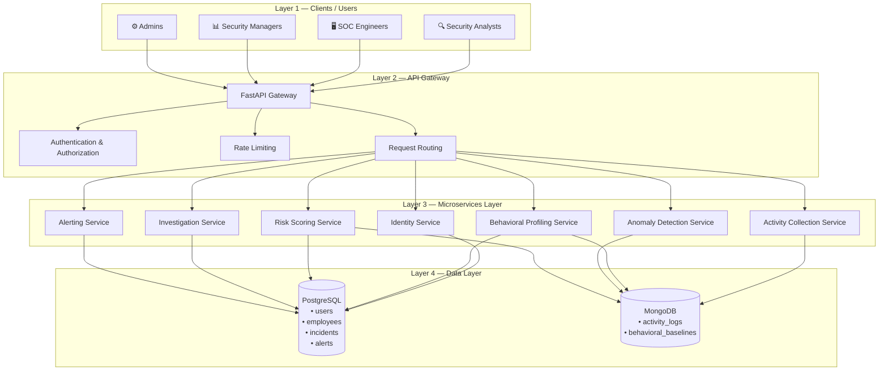
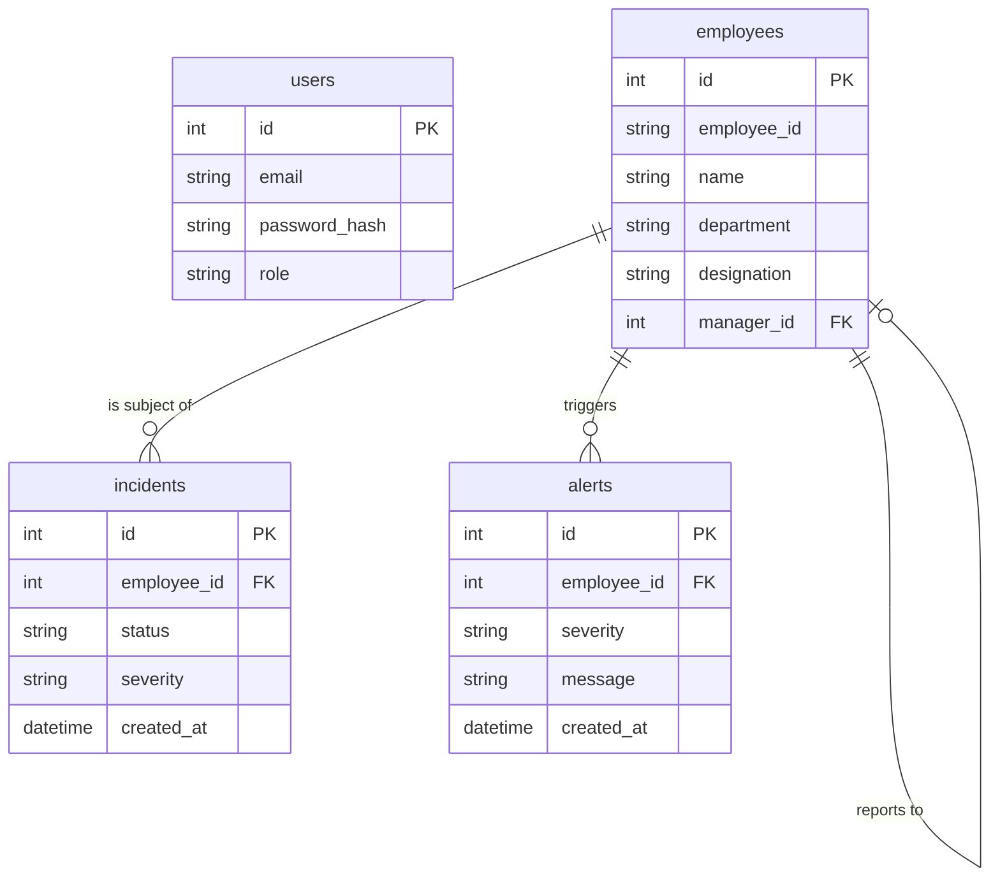

# Insider Threat Behavioral Intelligence System

## Architecture & Database Design Document

> **Milestone 1 — Part 1 (Day 1–2): Project Kickoff & Architecture Planning**

---

## 1. Project Overview

The **Insider Threat Behavioral Intelligence System** is an AI-powered cybersecurity platform designed to help organizations detect, investigate, and respond to insider threats. It provides continuous monitoring and intelligent analysis of employee activity to identify potential security risks before they cause harm.

### Core Capabilities

| Capability | Description |
|---|---|
| **Activity Monitoring** | Collect and centralize employee digital-activity data (logins, file access, network usage, etc.). |
| **Behavioral Baselining** | Establish per-employee behavioral profiles that represent "normal" working patterns. |
| **Anomaly Detection** | Flag deviations from established baselines using statistical and AI-driven methods. |
| **Risk Scoring** | Calculate a composite insider-risk score for each employee based on multiple indicators. |
| **Investigation Support** | Provide security teams with contextual data, timelines, and evidence for efficient investigations. |
| **Alerting & Reporting** | Deliver real-time alerts and dashboards for Security Analysts, SOC Engineers, and Managers. |

### Target Users

- **Security Analysts** — investigate anomalies, review alerts, and conduct deep-dives.
- **SOC Engineers** — monitor live dashboards and respond to real-time events.
- **Security Managers** — review risk trends, approve escalations, and oversee investigations.
- **Admins** — manage users, configure system settings, and maintain platform health.

---

## 2. Architecture Overview

The system follows a **4-layer architecture** that cleanly separates concerns across clients, API routing, business logic, and data storage.



---

## 3. Architecture Layers — Detailed Explanation

### Layer 1 — Clients / Users

This layer represents the human users who interact with the platform through web-based dashboards, investigation consoles, and administrative interfaces.

| Role | Primary Interactions |
|---|---|
| **Security Analysts** | Review alerts, investigate anomalies, access employee timelines. |
| **SOC Engineers** | Monitor live dashboards, respond to real-time security events. |
| **Security Managers** | View risk trends, approve/escalate incidents, generate reports. |
| **Admins** | Manage user accounts, configure thresholds, maintain system settings. |

All client requests flow through the API Gateway (Layer 2) — no direct access to backend services or databases is permitted.

---

### Layer 2 — API Gateway

The API Gateway is built with **FastAPI** and serves as the single entry point for all client requests.

**Responsibilities:**

- **Request Routing** — Directs incoming requests to the appropriate backend service module.
- **Authentication & Authorization** — Validates user credentials, enforces role-based access control, and ensures only authorized users reach protected endpoints.
- **Rate Limiting** — Prevents abuse and ensures fair resource usage by throttling excessive requests.
- **Input Validation** — Validates and sanitizes all incoming request data before it reaches the backend services.

FastAPI was chosen for its Python ecosystem alignment (important for AI/ML integration in later milestones), built-in API documentation, and support for data validation.

---

### Layer 3 — Microservices Layer

The backend logic is organized into **seven logical service modules**. These are not separate physical servers — they are organized backend modules within the same application, promoting separation of concerns and maintainability.

| Service | Responsibility | Primary Data Store |
|---|---|---|
| **Identity Service** | User registration, login, authentication, and role management. | PostgreSQL |
| **Activity Collection Service** | Ingest, normalize, and store employee activity events. | MongoDB |
| **Behavioral Profiling Service** | Build and maintain per-employee behavioral baselines. | MongoDB + PostgreSQL |
| **Anomaly Detection Service** | Compare real-time activity against baselines; flag deviations. | MongoDB |
| **Risk Scoring Service** | Compute composite risk scores from multiple indicators. | PostgreSQL + MongoDB |
| **Investigation Service** | Manage incident lifecycle, timelines, and evidence gathering. | PostgreSQL |
| **Alerting Service** | Generate, deliver, and track security alerts. | PostgreSQL |

---

### Layer 4 — Data Layer

The data layer uses a **dual-database strategy**, combining PostgreSQL and MongoDB to leverage the strengths of each.

#### PostgreSQL (Relational)

Handles structured, relational data that requires ACID transactions, referential integrity, and complex joins.

#### MongoDB (Document)

Handles high-volume, flexible-schema data such as activity logs and behavioral baselines where documents vary in structure and arrive at high throughput.

> Detailed schemas for both databases are documented in Sections 4 and 5 below.

---

## 4. PostgreSQL Schema

### 4.1 `users`

Stores platform user accounts (Security Analysts, SOC Engineers, Managers, Admins).

| Column | Description |
|---|---|
| `id` | Primary key, unique user identifier. |
| `email` | User email address (unique, used for login). |
| `password_hash` | Hashed password (never stored in plain text). |
| `role` | User role: `analyst`, `soc_engineer`, `manager`, or `admin`. |

---

### 4.2 `employees`

Stores records of monitored employees within the organization.

| Column | Description |
|---|---|
| `id` | Primary key, unique record identifier. |
| `employee_id` | Organization-assigned employee ID (unique, e.g., `EMP-0042`). |
| `name` | Full name of the employee. |
| `department` | Department (e.g., `Engineering`, `Finance`). |
| `designation` | Job title / designation. |
| `manager_id` | References another employee's `id` (nullable, self-referencing foreign key). |

---

### 4.3 `incidents`

Tracks security incidents created during investigations.

| Column | Description |
|---|---|
| `id` | Primary key, unique incident identifier. |
| `employee_id` | Foreign key referencing `employees(id)` — the employee associated with this incident. |
| `status` | Incident status: `open`, `investigating`, `resolved`, or `closed`. |
| `severity` | Severity level: `low`, `medium`, `high`, or `critical`. |
| `created_at` | Timestamp when the incident was created. |

---

### 4.4 `alerts`

Stores security alerts generated by the Alerting Service.

| Column | Description |
|---|---|
| `id` | Primary key, unique alert identifier. |
| `employee_id` | Foreign key referencing `employees(id)` — the employee this alert pertains to. |
| `severity` | Alert severity: `low`, `medium`, `high`, or `critical`. |
| `message` | Human-readable alert description. |
| `created_at` | Timestamp when the alert was generated. |

---

### Entity-Relationship Overview



---

## 5. MongoDB Collections

### 5.1 `activity_logs`

Stores raw employee activity events ingested by the Activity Collection Service. Each document represents a single event.

**Document Structure:**

```json
{
  "employee_id": "EMP-0042",
  "event_type": "login",
  "timestamp": "2026-08-22T14:30:00Z",
  "details": {
    "ip_address": "192.168.1.105",
    "location": "Building A, Floor 3",
    "device": "LAPTOP-7X9K",
    "status": "success"
  }
}
```

| Field | Type | Description |
|---|---|---|
| `employee_id` | `String` | Organization-assigned employee ID (matches `employees.employee_id` in PostgreSQL). |
| `event_type` | `String` | Type of activity event (e.g., `login`, `file_access`, `email_sent`, `usb_usage`, `network_request`). |
| `timestamp` | `ISODate` | UTC timestamp of when the event occurred. |
| `details` | `Object` | Flexible sub-document containing event-specific metadata (varies by `event_type`). |

---

### 5.2 `behavioral_baselines`

Stores computed behavioral baselines for each employee. Each document represents one behavioral indicator for one employee.

**Document Structure:**

```json
{
  "employee_id": "EMP-0042",
  "indicator": "avg_daily_logins",
  "typical_value": 3.2,
  "last_updated": "2026-08-21T00:00:00Z"
}
```

| Field | Type | Description |
|---|---|---|
| `employee_id` | `String` | Organization-assigned employee ID. |
| `indicator` | `String` | Name of the behavioral indicator (e.g., `avg_daily_logins`, `avg_file_downloads`, `typical_work_hours`). |
| `typical_value` | `Number` | The computed baseline value for this indicator. |
| `last_updated` | `ISODate` | UTC timestamp of the most recent baseline recalculation. |

---

## 6. Why Two Databases?

The platform deliberately uses **PostgreSQL** and **MongoDB** together because different categories of data have fundamentally different characteristics:

| Concern | PostgreSQL | MongoDB |
|---|---|---|
| **Data shape** | Fixed, well-defined schemas (users, employees, incidents, alerts). | Flexible, varying schemas (activity events have different `details` per event type). |
| **Integrity** | ACID transactions, foreign keys, and referential integrity are essential for user accounts and incidents. | Strict consistency is less critical for activity log ingestion. |
| **Query patterns** | Complex joins across related tables (e.g., "all incidents for employees in Finance"). | Time-series queries and document-level lookups (e.g., "all login events for EMP-0042 in the last 24 hours"). |
| **Write volume** | Moderate — user and incident records change infrequently. | Higher — activity events are generated frequently across all employees. |
| **Schema evolution** | Schema changes require migrations. | New fields can be added to documents without migrations. |

**In short:**

- **PostgreSQL** is the right tool for **structured relational data** that demands consistency, integrity, and complex querying.
- **MongoDB** is the right tool for **flexible-schema data** like activity logs and behavioral baselines where document structure varies by event type.

---

## 7. Part 1 Completion Checklist

| # | Task | Status |
|---|---|---|
| 1 | Project purpose understood and documented | ✅ Done |
| 2 | 4-layer architecture planned and diagrammed | ✅ Done |
| 3 | Layer 1 — Clients/Users identified | ✅ Done |
| 4 | Layer 2 — API Gateway (FastAPI) documented | ✅ Done |
| 5 | Layer 3 — Microservices/modules listed and described | ✅ Done |
| 6 | Layer 4 — Data Layer (PostgreSQL + MongoDB) documented | ✅ Done |
| 7 | PostgreSQL schema documented (users, employees, incidents, alerts) | ✅ Done |
| 8 | MongoDB collections documented (activity_logs, behavioral_baselines) | ✅ Done |
| 9 | Dual-database rationale explained | ✅ Done |

> **Milestone 1, Part 1 architecture and database planning is documented and ready for review.** The next phase (Part 2) will begin actual project setup and implementation.

---

*Document created as part of Milestone 1 — Infosys Springboard Internship Project.*
