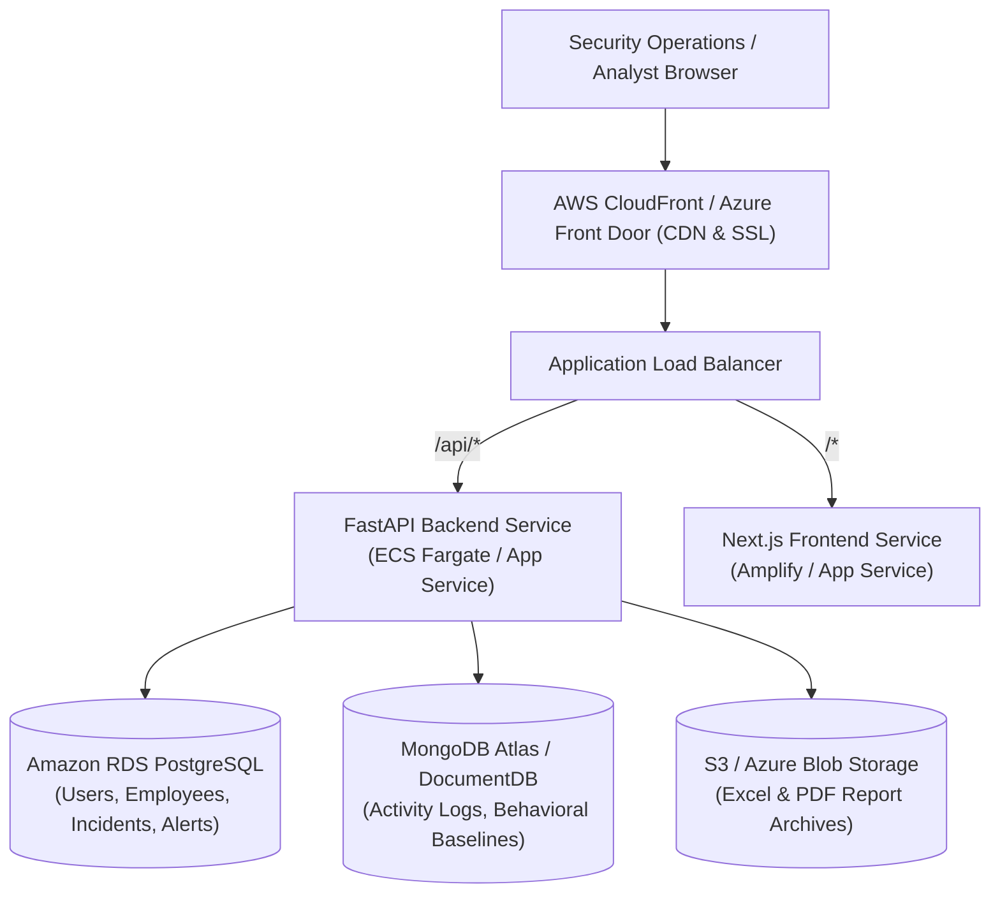

# Cloud Deployment Guide — Insider Threat Behavioral Intelligence System (ITBIS)

This guide documents the enterprise cloud deployment architecture, configuration steps, and environment settings for running ITBIS on **AWS (Elastic Beanstalk / ECS Fargate)** and **Microsoft Azure (Azure App Service)**.

---

## 1. Cloud Architecture Overview

ITBIS utilizes a decoupled microservices architecture with a dual-database persistence strategy:
- **Presentation Layer**: Next.js 16 Web Dashboard (Node.js runtime or containerized static build).
- **Application & Intelligence Layer**: FastAPI ASGI REST API with pre-trained Isolation Forest ML models and UEBA calculation engines.
- **Relational Persistence (ACID)**: Managed PostgreSQL (AWS RDS or Azure Database for PostgreSQL Flexible Server).
- **Document / Telemetry Persistence**: Managed MongoDB (AWS DocumentDB, MongoDB Atlas, or Azure Cosmos DB MongoDB vCore).



---

## 2. Environment Variables Checklist

Ensure the following environment variables are securely stored in **AWS Secrets Manager / Parameter Store** or **Azure Key Vault**:

| Variable Name | Description | Example / Recommended Value |
| :--- | :--- | :--- |
| `DATABASE_URL` | PostgreSQL connection string | `postgresql://itbis_admin:<PWD>@itbis-rds.c123.us-east-1.rds.amazonaws.com:5432/itbis` |
| `MONGO_URL` | MongoDB connection string | `mongodb+srv://itbis_user:<PWD>@itbis-cluster.mongodb.net/itbis?retryWrites=true&w=majority` |
| `SECRET_KEY` | High-entropy JWT signing key (256-bit) | Cryptographically generated 64-char hex string (`openssl rand -hex 32`) |
| `ALGORITHM` | JWT cryptographic algorithm | `HS256` |
| `ACCESS_TOKEN_EXPIRE_MINUTES` | Session token lifetime | `1440` (24 hours) |
| `NEXT_PUBLIC_API_URL` | Public-facing URL of the FastAPI backend | `https://api.itbis.enterprise.internal` |
| `PORT` | Container binding port | `8000` (Backend) / `3000` (Frontend) |
| `CORS_ORIGINS` | Permitted browser origins | `https://itbis.enterprise.internal` |

---

## 3. Deployment Option A: AWS (ECS Fargate + RDS + Atlas)

### Step 1: Database Provisioning
1. **Amazon RDS PostgreSQL**:
   - Provision RDS PostgreSQL 15 (db.t4g.medium for production).
   - Enable Multi-AZ deployment and automatic backups.
   - Configure VPC security group to allow inbound port 5432 only from ECS tasks.
2. **MongoDB Atlas / Amazon DocumentDB**:
   - Create an M10+ MongoDB Atlas cluster or AWS DocumentDB cluster.
   - Whitelist the AWS VPC CIDR and obtain the replica set connection URI.

### Step 2: Container Image Build & ECR Push
```bash
# Authenticate to AWS ECR
aws ecr get-login-password --region us-east-1 | docker login --username AWS --password-stdin <ACCOUNT_ID>.dkr.ecr.us-east-1.amazonaws.com

# Build & Push Backend
docker build -t itbis-backend ./backend
docker tag itbis-backend:latest <ACCOUNT_ID>.dkr.ecr.us-east-1.amazonaws.com/itbis-backend:latest
docker push <ACCOUNT_ID>.dkr.ecr.us-east-1.amazonaws.com/itbis-backend:latest

# Build & Push Frontend
docker build -t itbis-frontend ./frontend
docker tag itbis-frontend:latest <ACCOUNT_ID>.dkr.ecr.us-east-1.amazonaws.com/itbis-frontend:latest
docker push <ACCOUNT_ID>.dkr.ecr.us-east-1.amazonaws.com/itbis-frontend:latest
```

### Step 3: ECS Task Definition & Service Creation
1. Define ECS task for `itbis-backend` with:
   - CPU: 1024, Memory: 2048 MB.
   - Container port: 8000.
   - Health check: `curl -f http://localhost:8000/ || exit 1`.
2. Define ECS task for `itbis-frontend` with:
   - CPU: 512, Memory: 1024 MB.
   - Container port: 3000.
3. Attach both services to an Application Load Balancer (ALB) with path-based routing:
   - `/api/*` or `api.itbis.domain` routes to backend target group.
   - `/*` routes to frontend target group.

---

## 4. Deployment Option B: Azure (Azure App Service + Azure Database)

### Step 1: Azure Database Provisioning
```bash
# Create Resource Group
az group create --name itbis-rg --location eastus

# Create PostgreSQL Flexible Server
az postgres flexible-server create \
  --resource-group itbis-rg \
  --name itbis-postgres-server \
  --admin-user itbisadmin \
  --admin-password "<STRONG_PASSWORD>" \
  --sku-name Standard_B2s \
  --tier Burstable \
  --version 15
```

### Step 2: Azure Cosmos DB (MongoDB API)
```bash
az cosmosdb create \
  --resource-group itbis-rg \
  --name itbis-cosmos-mongo \
  --kind MongoDB \
  --default-consistency-level Session
```

### Step 3: Azure App Service Deployment
```bash
# Create App Service Plan (Linux)
az appservice plan create \
  --resource-group itbis-rg \
  --name itbis-plan \
  --is-linux \
  --sku B2

# Create Backend Web App (Container)
az webapp create \
  --resource-group itbis-rg \
  --plan itbis-plan \
  --name itbis-backend-app \
  --deployment-container-image-name <REGISTRY>/itbis-backend:latest

# Configure App Settings
az webapp config appsettings set \
  --resource-group itbis-rg \
  --name itbis-backend-app \
  --settings \
    DATABASE_URL="postgresql://itbisadmin:<PASSWORD>@itbis-postgres-server.postgres.database.azure.com:5432/itbis?sslmode=require" \
    MONGO_URL="<COSMOS_MONGO_CONNECTION_STRING>" \
    SECRET_KEY="<STRONG_SECRET_KEY>" \
    PORT=8000
```

---

## 5. Pre-Flight Database Migration & Seed Verification

Once cloud database instances are reachable, execute initial seeding from a secure bastion host or CI/CD runner:
```bash
# Run relational migrations and seed 10,000 baseline telemetry events
python backend/app/seed_data.py
python backend/app/seed_10k_data.py
```

---

## 6. Production Readiness & Security Checklist

- [x] **Zero Hardcoded Secrets**: All credentials loaded strictly from environment.
- [x] **HTTPS/TLS Termination**: Enforce TLS 1.3 across CloudFront / ALB / Front Door.
- [x] **Database Isolation**: Databases deployed in private VPC subnets with zero public exposure.
- [x] **Least Privilege RBAC**: Database roles limited strictly to `itbis` database scope.
- [x] **Automated Healthchecks**: Both container definitions include health check probes.
- [x] **CORS Configuration**: Restrict FastAPI CORS origins strictly to authorized enterprise domains.
