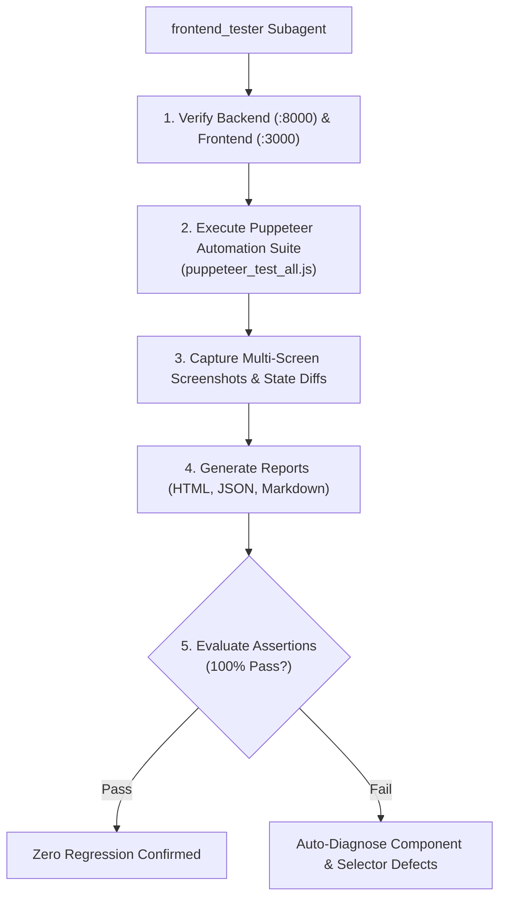

# ITBIS Subagent Specification: `frontend_tester`

The **`frontend_tester`** subagent is a dedicated automated quality assurance and visual verification agent for the Insider Threat Behavioral Intelligence System (ITBIS).

---

## 1. Overview & Capabilities

The `frontend_tester` subagent autonomously verifies the entire ITBIS Next.js presentation layer using a headless/visual Puppeteer automation engine.



---

## 2. Test Scope & Matrix

| Screen / Feature | Route / Action | Key UI Controls & Elements Tested | Target Personas |
| :--- | :--- | :--- | :--- |
| **Landing Page** | `/` | Hero section, backend status pill, feature cards, login/signup links | All / Public |
| **Authentication** | `/login`, `/signup` | 1-Click Demo login buttons, registration form, validation error alerts | All 4 Personas |
| **Analyst Dashboard** | `/dashboard/analyst` | 24h/7d/30d time-range filter, radar scanner, alert triage ("Investigate", "Resolve") | `security_analyst` |
| **SOC Dashboard** | `/dashboard/soc` | Live telemetry stream, pause/resume toggle, event type filters, manual log ingest modal | `soc_engineer` |
| **Manager Dashboard**| `/dashboard/manager` | Department risk comparison, top-risk employee leaderboard, compliance links | `security_manager` |
| **Admin Dashboard** | `/dashboard/admin` | PostgreSQL and MongoDB live status badges, system telemetry metrics | `admin` |
| **Global Controls** | Header & Modal | Audio Alarm mute/unmute, Role notifications dropdown, Profile dropdown, Threat simulation modal | All Roles |
| **Threat Simulation**| `/anomalies` & Header | USB Exfiltration, Sudo Privilege Abuse, Off-Hours MFA Attack, Cloud Data Dump, Reset simulation | All Roles |
| **Employee Directory**| `/employees` | Department filter pills, search bar, 5-factor risk bars, employee drawer, registration modal | All Roles |
| **Employee Dossier** | `/employees/[id]` | 360-degree risk tabs (Overview, UEBA radar, baseline comparison, activity timeline) | All Roles |
| **Incident Workspace**| `/incidents` | Status & severity filter tabs, search, "Open Investigation Case" modal | All Roles |
| **Incident Deep-Dive**| `/incidents/[id]` | Chronological synthesized timeline, evidence notes tab, note creation, resolve modal | `security_analyst`, `admin` |
| **Activity Logs** | `/logs` | MongoDB 10k+ log table, event filter, pagination controls (Next/Prev), refresh | All Roles |
| **Alerts Queue** | `/alerts` | Priority filters, status transitions, "Execute ML Threat Scan" trigger | All Roles |
| **Behavioral Anomalies**| `/anomalies` | Isolation Forest diagnostics, baselines tab with employee picker, live sandbox prediction | All Roles |
| **Executive Reports** | `/reports` | Department risk breakdown, regulatory compliance checklist, CSV report download | `security_manager`, `admin` |
| **Admin RBAC** | `/admin` | User directory table, role selector dropdown, audit trail export | `admin` |
| **Support Center** | `/support` | System architecture diagrams, RESTful API endpoint explorer, FAQ accordion | All Roles |
| **Navigation & Session**| Sidebar & Logout | Sidebar navigation links, secure session termination, redirection to `/login` | All Roles |

---

## 3. How to Invoke the Subagent

### Via Agent Invocation Tool:
```json
{
  "TypeName": "frontend_tester",
  "Role": "Frontend QA Automation Specialist",
  "Prompt": "Run the full Puppeteer end-to-end UI test suite, verify all 18+ screens and interactive buttons, inspect generated screenshots and HTML reports, and confirm 100% test pass rate."
}
```

### Via CLI Terminal Commands:
```powershell
# From repository root:
node run_puppeteer_tests.js

# From frontend directory:
npm run test:e2e --prefix "frontend"
```

---

## 4. Test Reports & Artifacts Generated

1. **Interactive HTML Test Report**:  
   `frontend/test-results/reports/puppeteer-test-report.html`
2. **Structured JSON Summary**:  
   `frontend/test-results/reports/test-summary.json`
3. **Markdown Test Summary**:  
   `frontend/test-results/reports/summary.md`
4. **Visual Screenshots Gallery**:  
   `frontend/test-results/screenshots/*.png` (40+ captured full-page screenshots).
